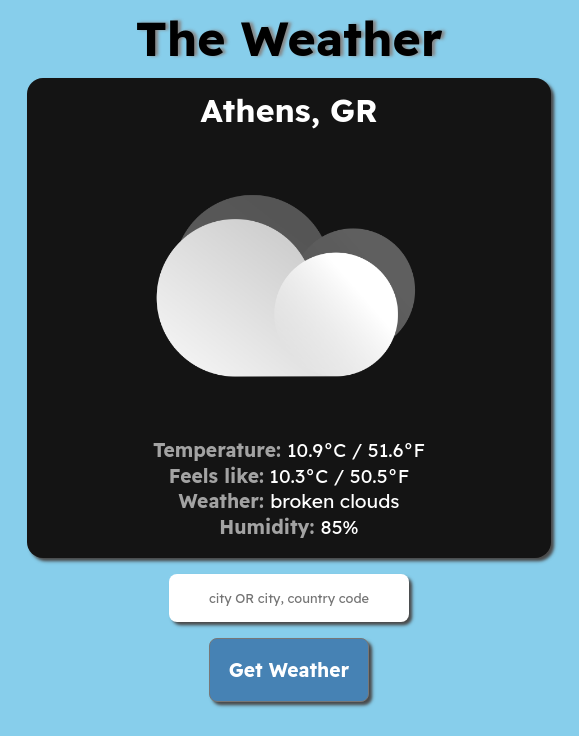

# A simple weather App

## It gets you the weather.

Fancy, right?

This is an exercise from Social Hackers Academy where I learned about making API calls and used promises with vanilla JavaScript.

Icons courtesy of <a href="https://www.iconfinder.com/laurareen">Laura Reen</a>.

## Instructions:

Type in the city you want to find or the city and its country code (US, GR, etc) and press Enter or click/tap on the Get Weather button.

<a href="https://hjp-weather.netlify.app" target="_blank">Try it out!</a>

## Issues / TO-DO:

Tried to think of a city name with three separate words but couldn't think of one so for the time being this works for two-word cities such as "San Antonio", "Los Angeles", etc.

